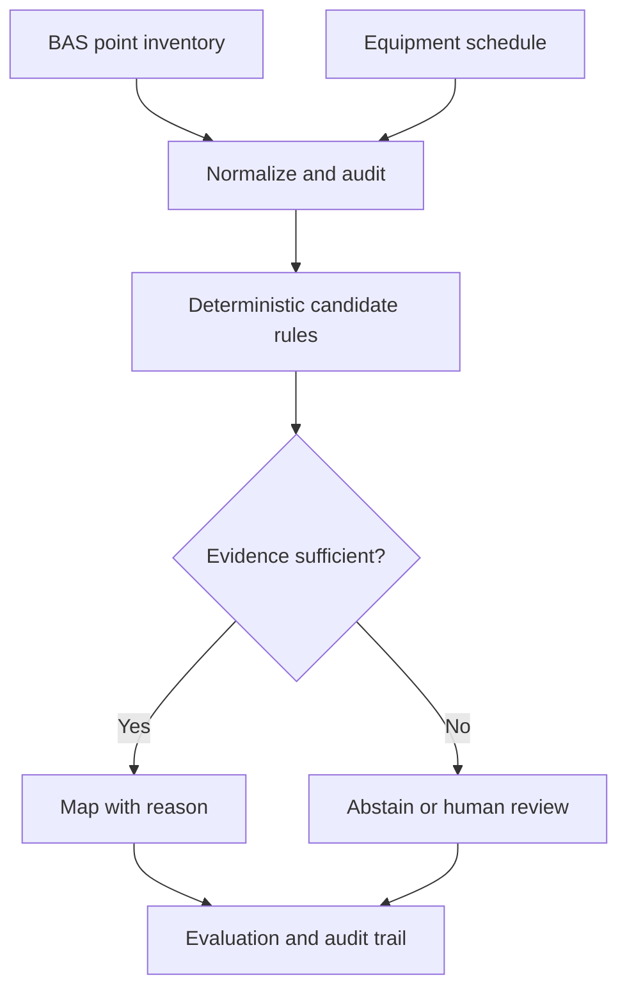

# Auditable HVAC Point-to-Equipment Mapping

An explainable, agent-ready workflow for mapping building automation system (BAS) points to HVAC equipment without allowing a language model to invent unsupported relationships.

This portfolio project grew from an industry-sponsored Georgia Tech OMS Analytics practicum. All client data, drawings, identifiers, and credentials have been removed. The repository runs entirely on synthetic data.

## Why this matters

Building controls data is often difficult to use because point names, equipment schedules, and semantic tags are incomplete or inconsistent. Project Haystack helps standardize semantic descriptions, but real-world integration still requires entity resolution and evidence-aware validation.

This project treats mapping as a controlled decision problem:



The central design principle is **abstention**. A plausible-looking match is not accepted unless the available identifiers and tags support it.

## Demonstrated capabilities

- Normalizes Project Haystack-style tags and removes null-like values.
- Extracts equipment family, floor, and unit identifiers from BAS point names.
- Detects point/tag disagreements before attempting a match.
- Maps only exact schedule candidates and records a human-readable reason.
- Routes conflicts to review and unsupported candidates to abstention.
- Evaluates automated mappings separately from abstentions.
- Produces reproducible CSV and JSON artifacts with no API key or paid model.

## Quick start

```bash
python scripts/generate_synthetic_data.py
python -m hvac_mapping.cli \
  --points data/synthetic/bas_points.csv \
  --schedule data/synthetic/equipment_schedule.csv \
  --output-dir outputs/demo
python -m unittest discover -s tests -v
```

Python 3.10+ is supported. Install the package for development with:

```bash
python -m pip install -e .
```

## Synthetic demonstration results

The included fixture deliberately contains exact matches, unsupported floors and units, tag conflicts, missing tags, non-HVAC points, and duplicate records. The expected results are stored in `outputs/demo/metrics.json` and verified in CI.

| Synthetic check | Result |
|---|---:|
| Point records | 52 |
| Exact-match records | 34 |
| Abstentions | 13 |
| Conflict reviews | 2 |
| Out-of-scope records | 3 |
| Scheduled equipment covered | 11 of 11 |

These demonstration metrics validate software behavior—not performance on an unseen building.

## From prototype to reliable agent

The original prototype used an LLM too early in the workflow. This redesign establishes deterministic candidates, schema validation, abstention, and a human evaluation loop first. A future agent can then retrieve drawing evidence and rank only constrained candidates.

| Layer | Responsibility | LLM allowed? |
|---|---|---:|
| Data audit | Normalize tags, duplicates, missing data | No |
| Candidate generation | Exact identifier and schedule constraints | No |
| Evidence retrieval | Pull relevant schedule/drawing context | Optional |
| Candidate ranking | Explain ambiguity among valid candidates | Yes |
| Validation | Schema, consistency, confidence threshold | No |
| Approval | Human review for uncertain cases | Human |

## Practicum case study

On the private practicum dataset, the rebuilt deterministic baseline audited 2,294 point records and a 48-equipment schedule. It generated 142 high-confidence point-level candidate mappings covering 47 schedule entries, while correctly abstaining on an important unsupported-floor example. These are aggregate engineering results, not a claim of measured accuracy; independent labels are still required.

Read the [case study](docs/case-study.md), [system design](docs/system-design.md), and [data governance policy](DATA_GOVERNANCE.md).

## Standards and domain context

- [Project Haystack](https://www.project-haystack.org/) standardizes semantic data models and web services for IoT and building systems.
- [U.S. Department of Energy: Building Controls](https://www.energy.gov/cmei/buildings/building-controls) describes the role of interoperable, high-performance controls.
- [ASHRAE Guideline 36](https://www.ashrae.org/professional-development/all-instructor-led-training/catalog-of-instructor-led-training/guideline-36-best-in-class-hvac-control-sequences) provides high-performance HVAC control sequences.

## Author

Weili Weng — climate, energy, analytics, and AI-agent practitioner; Georgia Tech OMS Analytics candidate (expected January 2027).

## License

MIT. Synthetic data only.
