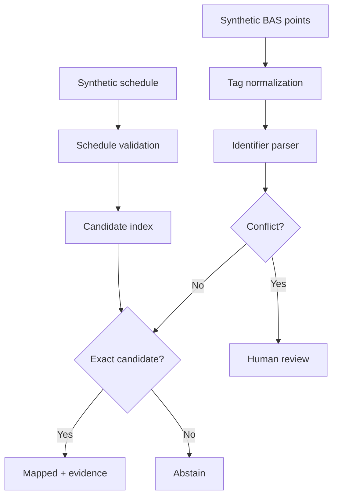
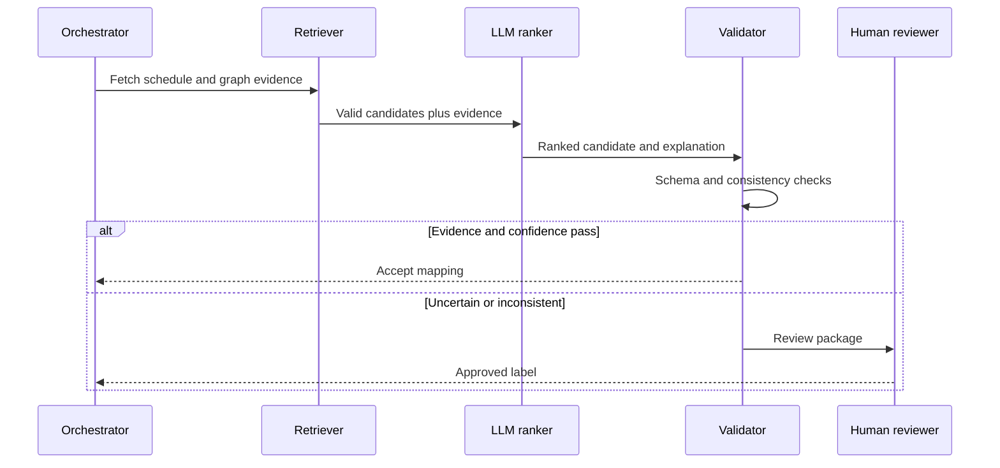

# System Design

## Current implementation

The current repository implements the deterministic control plane. It is intentionally usable without an LLM.

## Proposed agent layer

An agent should operate only after deterministic candidate generation.

## Production metrics

- selective precision among automated mappings;
- abstention validity and missed-mapping rate;
- equipment coverage;
- reviewer minutes per 100 points;
- schema-validation failure rate;
- drift by site, equipment family, and naming convention.
